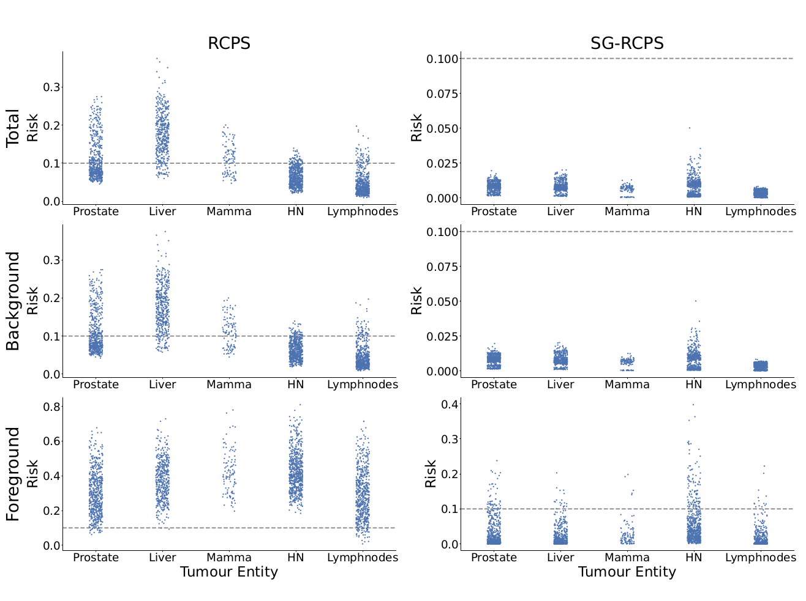

# Subgroup-Specific Risk-Controlled Dose Estimation in Radiotherapy

This repository is based on the code from [Image-to-Image Regression with Distribution-Free Uncertainty Quantification and Applications in Imaging](https://github.com/aangelopoulos/im2im-uq). We extended this framework to perform subgroup-calibration for unknown subgroups at test time. The paper can be found [here](https://arxiv.org/abs/2407.08432). 


## Method overview
<div style="displaystyle=block;align=center;"><p align="center" >
  
  </p>
</div>

## Results
<div style="displaystyle=block;align=center;"><p align="center" >
  
  </p>
</div>

## Dataset and implementation
For dependencies and installation instructions please refer to [Angelopoulos et al.](https://github.com/aangelopoulos/im2im-uq). 
In order to perform subgroup calibration you need to provide independent calibration sets for each subgroup and adjust the loss computation accordingly. 

The dataset used in this work collected at the University Hospital Tuebingen and cannot be made publicly available.

## References
```
@misc{fischer2024subgroupspecificriskcontrolleddoseestimation,
      title={Subgroup-Specific Risk-Controlled Dose Estimation in Radiotherapy}, 
      author={Paul Fischer and Hannah Willms and Moritz Schneider and Daniela Thorwarth and Michael Muehlebach and Christian F. Baumgartner},
      year={2024},
      eprint={2407.08432},
      archivePrefix={arXiv},
      primaryClass={cs.LG},
      url={https://arxiv.org/abs/2407.08432}, 
}
```
